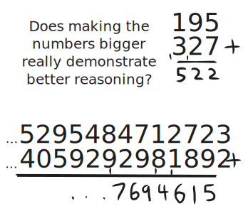
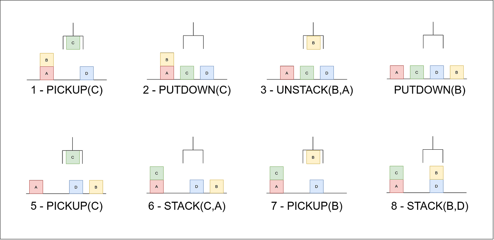
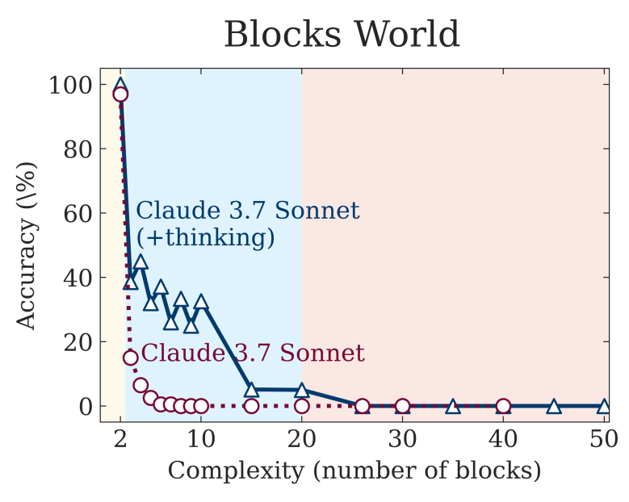
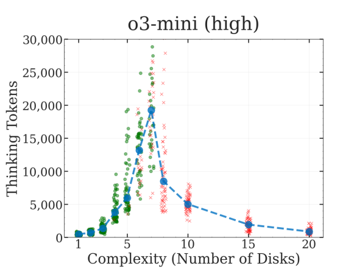
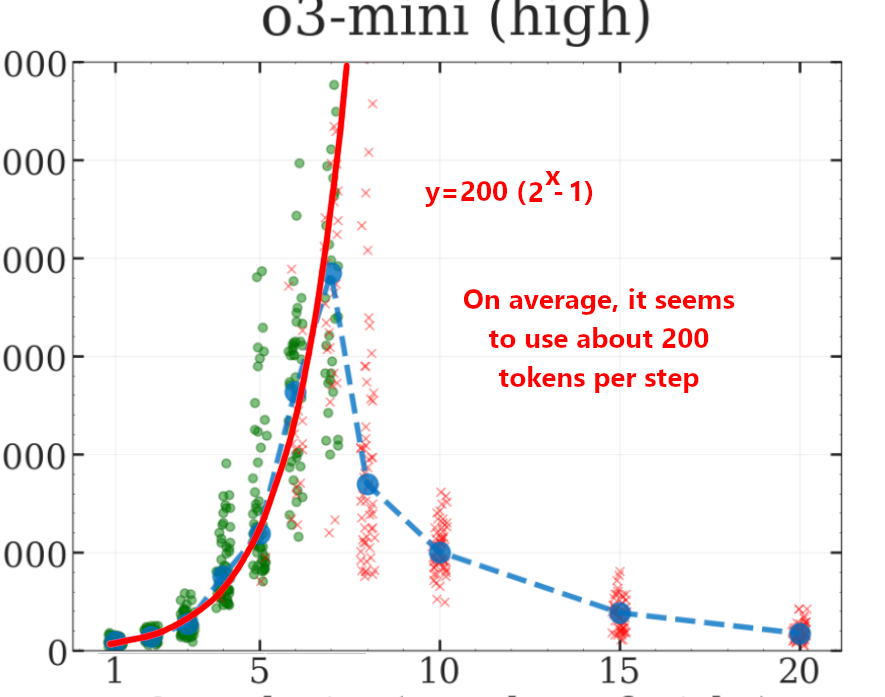

Apple researchers recently released a rather bold paper called [The Illusion of Thinking](https://ml-site.cdn-apple.com/papers/the-illusion-of-thinking.pdf), which was picked up by both media outlets and social media alike as some kind of proof that AI is a fad, or that they are incapable of reasoning, or one of many other claims.

<iframe style="width:100%;aspect-ratio:16/9" src="https://www.youtube.com/embed/u31qwQUeGuM?si=2x97uFDoJqOfAdu4" title="YouTube video player" frameborder="0" allow="accelerometer; autoplay; clipboard-write; encrypted-media; gyroscope; picture-in-picture; web-share" referrerpolicy="strict-origin-when-cross-origin" allowfullscreen></iframe>

However, this isn't just a case of people reading the title and making up some fantastical story - the paper really does make some absurd and quite frankly unfounded claims, although they aren't quite the claims reported in most online coverage.

# So what are they *really* claiming?

The current frontier of AI models are all something known as Large Reasoning Models (LRMs). These are regular Large Language Models (LLMs) that have been trained specifically to write out their line of reasoning, often referred to as a "chain of thought", before giving an answer. This approach gives significantly better accuracy on difficult or large tasks requiring reasoning.

This paper makes the case that LRMs have the same fundamental limitations as LLMs, and are not capable of generalised reasoning. They also make various smaller implications throughout the paper, including that LRMs aren't actually doing reasoning, they are just pattern matching to data they've seen while training.

Yet, despite these very bold claims - after all, this is going against essentially all prior precedence - the paper is riddled with poor assumptions, a lack of consideration for obvious potential issues, and at the end of it all even their own results seem to contradict their conclusions.

# An Error in Assumption

To evaluation the reasoning capabilities of LRMs vs LLMs, the paper tests the models on a variety of logic puzzles. I'd encourage you to read the paper itself, as despite its issues, it is written fairly well, and is not particularly technical or difficult to read. That said, I'll still provide a quick overview of one of the problems - Towers of Hanoi.

Towers of Hanoi is a classic logic puzzle, often used in machine learning, that involves moving a stack of rings starting on the left pole all onto the right pole. However, you can only move one ring at a time, and you're not allowed to stack a larger ring on top of a smaller one. The goal is to find the shortest sequence of moves to carry out this task. You can try it out below!



To an onlooker, this seems like a decent enough test of reasoning. However, there is actually a very simple, well-known algorithm that allows you to solve Towers of Hanoi for any number of rings in an optimal way. It's not the most intuitive, but if you want to, you can follow it step by step without even considering the actual puzzle.

I would argue that being able to follow a straightforward set of instructions step by step isn't really indicative of reasoning. Solving Towers of Hanoi with a larger number of disks is more work, and arguably 'harder', as it requires more steps, but it's not really demonstrating that it's better at reasoning.

If I asked you to add two long numbers, you could probably do it fine - there is a pretty simple process for adding numbers together via column addition. I could also say that adding two 50-digit numbers together is harder than just 195 + 327. There's certainly more chance of making a mistake. But would we really say that being able to add long numbers together this way indicates that you are better at reasoning, or are you just better at reliably carrying out a long set of simple steps.

The paper makes the observation that when told explicitly to use this algorithm, the models don't do any better. But then very strangely, they make the absurd claim that this shows that they are just repeating answers they've seen during training. But there is another, far more obvious explanation - the models were already using that algorithm. After all, this algorithm is well known, and if you ask literally any AI model to solve Towers of Hanoi it will spit out the algorithm without fail, and then step through it to get the answer. Obviously, telling it to use the algorithm makes no difference - it was using it anyway!

# Think About it for a Second

Another one of the problems they evaluate the LLMs and LRMs on is Blocks World problems. This is quite similar to Tower of Hanoi, and involves a collection of blocks on a table, and a claw arm that can pick them up to move them around. The claw arm can be given instructions to pick up or put down a block, either from the table or onto/from the top of another block. The goal is to go from a starting arrangement of blocks to some given target arrangement in the shortest number of moves. An example of some moves can be seen below.

For only a handful of blocks - say 2 or 3 - it's quite easy to just sort of 'intuit' the solution. I would argue that while it displays some amount of reasoning, this doesn't generalise to even around 4 or 5 blocks. At that point, you need to start reasoning about the problem in a more structured way - considering sequences of moves more carefully, and likely writing some stuff down and keeping track of things.

Here is how the models performed - Claude 3.7 Sonnet is an LLM, and the (+thinking) model is the LRM version of the same model. The accuracy measures the percentage of the time that the model got the correct sequence of moves (correct runs divided by total runs).

And perhaps unsurprisingly, although it's not massively reliable, the LRM (thinking model) is able to solve the problem for up to 10 blocks in about 1 of every 4 tries, but the LLM is essentially incapable of solving it with more than 5 blocks, and is still not very good even for just 4 blocks. 

The LRM is even able to very occasionally get it correct for problems involving 20 blocks! That just isn't going to happen through chance - there is clearly something different in the way the LRM is considering the problem. 

It's also useful to consider that Blocks World puzzles don't have a known guaranteed good solution - for Towers of Hanoi, you will always get the optimal sequence of moves with the algorithm, but with Blocks World you really can't do much better than just looking at every possible sequence of moves (you can optimise this slightly, but it's an NP-hard problem in the general case).

As the number of blocks increases, the number of possible sequences of moves explodes exponentially. The more moves there are, and the more sequences you need to consider, the more likely it is that a small mistake will slip in and mess up the solution. Yet the authors of this paper claim that because the LRMs eventually fail to find the right answer if you increase the blocks enough, it shows that they have the same fundamental limitations as LLMs.

The paper also doesn't consider the amount of work it takes to find a solution for each problem - only the solution's length. As an example of the difference - imagine for some kind of game you have at any given point 2 moves you can make, and there's some optimal solution you need to find. We'll also assume that the best way you can solve this game is to just try every possible sequence of moves and record the shortest sequence that gets to the goal. If the solution requires 5 moves, we need to consider $2^5$ sequences of moves, which is 32. Now imagine that instead of a choice of 2 moves, you have a choice of 10. This means there are now $10^5$ possible sequences - that's 100,000!

The authors state in their conclusion that it's "surprising" that some problems requiring fewer moves for a solution seem harder for the AI models, but if you consider the number of possible solutions they need to consider, this "surprise" disappears.

A more thorough consideration of this can be seen [here](https://x.com/scaling01/status/1931854370716426246).

# Token Limits and Refusals

Another interesting observation in the paper that they draw strange conclusions from is that when a problem gets long enough, the LRMs begin to spend less time thinking than before. I'd like to highlight this (slightly messy) graph from the appendix of the paper as an example. LLMs and LRMs don't see characters or words, but instead "tokens", which may be just sections of a word or possibly multiple words, but these can be thought of as a reasonable measure for the length of the text that it produces when 'thinking'. The blue line gives the average number of tokens, the green circles represent that the run was correct, and the crosses represent failed runs.

As the number of disks for Tower of Hanoi increases, the number of tokens also increases, up until 8 disks, where it falls off a cliff and gets everything wrong. In fact, the shape of the graph looks suspiciously similar to the graph of how many steps are required to calculate a solution for Towers of Hanoi ( $2^n-1$ ).

So why does it suddenly stop? Well, there are a couple of issues here. I discovered [an article online](https://www.seangoedecke.com/illusion-of-thinking/) where the author decided to just try asking one of the models to solve Towers of Hanoi with 10 disks. Well, it turns out that the reason it does less thinking is because it stops running the algorithm! It decides that it's just too long to write out by hand, and looks for some alternative approach (iterative, rather than recursive).
![[Pasted image 20250615185341.png]]
After testing this myself on multiple models, while the point at which they decide to give up on doing it manually does vary, there is always a point at which they say it's either "impractical", "difficult", or just straight up "impossible" to do it all manually.

# It turns out, they're right!

In the Apple paper, they state that they placed a 64k token limit on the number of tokens in the answer (this includes non-thinking tokens too, so thinking tokens should be slightly less than this too).

I decided to do a few more calculations, as many of these logic problems scale exponentially - the amount of work required to solve them very rapidly increases. For Tower of Hanoi, as mentioned before, the number of moves required is $2^n -1$, where $n$ is the number of disks. For 20 disks, this gives us 1,048,575 - over 1 million moves! Obviously, even if it could pull the answer out of thin air, it's pointless to test the models on 20 disks, as it's impossible for them to even write it out!

After looking at o3-mini's token system, it takes around 8 tokens to output a single move in the format given in the paper. This means that even for 15 disks, it would require 262136 tokens just to output the final answer - this is without any room for thinking. 

Looking at the graph I provided before for o3-mini, the trend seems to be that it uses around 200 tokens per move required. If we extrapolate that out to 10 disks, we would expect it to use about 200,000 tokens - well beyond the limit.

As it turns out, the LRMs are correct in their assessment that this is impossible, although this is likely somewhat of a coincidence, as I doubt they were informed of the limit placed on them. Not all of the LRMs see this happen at the same time either - some choose to give up on manual work earlier, such as deepseek.

For some more precise calculations, read [this tweet](https://x.com/scaling01/status/1931783050511126954).

# In Summary

There are many other smaller issues I could bring up throughout the paper, whether it's the lack of information on the parameters used to sampling the models, the choice of a temperature of 1, the often strange prompts used for the problems or the simplistic parsing of the model's chain of thought, but overall I think I've addressed the main issues with the paper. Statements made in the paper such as "We show that state-of-the-art LRMs (e.g., o3-mini, DeepSeek-R1, Claude-3.7-Sonnet-Thinking) still fail to develop generalizable problem-solving capabilities" are unfounded, and arguably directly contradicted by their own results.

## Acknowledgements

Thanks to InfuriatinglyOpaque in DGG chat for discussion around this paper, as well as helping pull together various sources and articles.

For anyone with more of a background on testing reasoning, yes, Towers of Hanoi is often used to test and/or demonstrate reasoning of models, but this is almost exclusively in situations where the model being tested is not capable of utilising the algorithm, or in some cases, a model may be capable of using the algorithm, but Towers of Hanoi is just one of many (as in, often 1 of 50) problems tested, with the results from it being largely inconsequential to the conclusions of the paper.

If it's unclear why Towers of Hanoi is a different class of problem to the others, consider the steps required as a function of the solution length. Towers of Hanoi's algorithm is $O(n)$ with $n$ as solution length. Blocks World is $O(c^n)$, where $c$ is some branching factor.