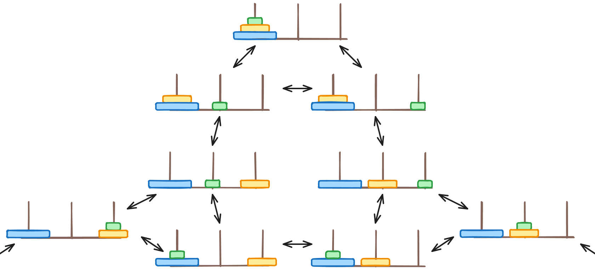
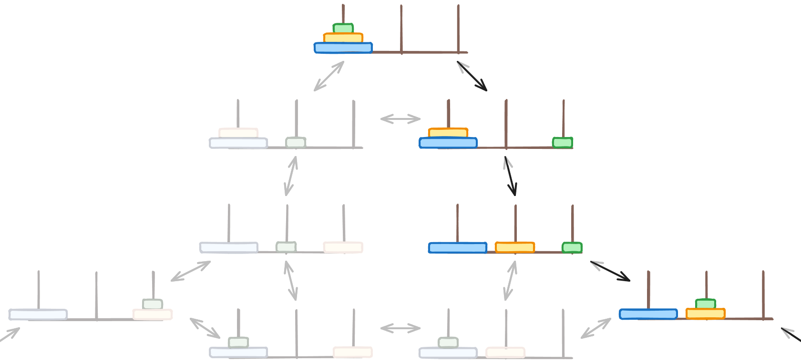
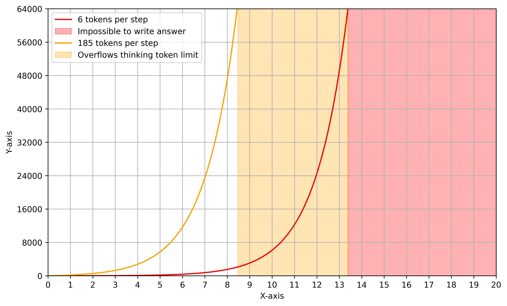
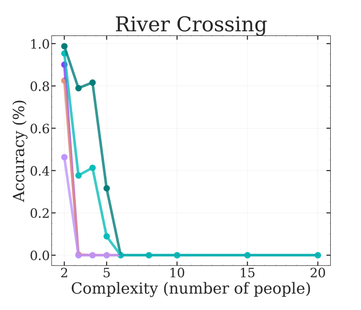
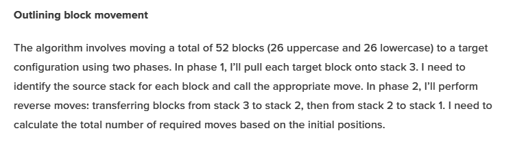
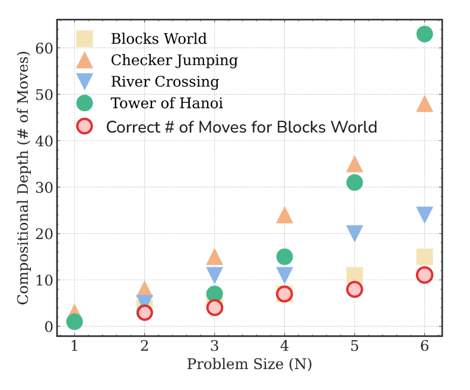

Apple researchers recently released a rather bold paper called [The Illusion of Thinking](https://ml-site.cdn-apple.com/papers/the-illusion-of-thinking.pdf), which was picked up by both media outlets and social media alike as some kind of proof that AI is a fad, or that they are incapable of reasoning, or one of many other claims.

<iframe style="width:100%;aspect-ratio:16/9" src="https://www.youtube.com/embed/u31qwQUeGuM?si=2x97uFDoJqOfAdu4" title="YouTube video player" frameborder="0" allow="accelerometer; autoplay; clipboard-write; encrypted-media; gyroscope; picture-in-picture; web-share" referrerpolicy="strict-origin-when-cross-origin" allowfullscreen></iframe>

However, this isn't just a case of people reading the title and making up some fantastical story - the paper really does make some absurd and quite frankly unfounded claims, although they aren't quite the claims reported in most online coverage.

# 'Generalisable' Problem Solving

> We show that state-of-the-art LRMs (e.g., o3-mini, DeepSeek-R1, Claude-3.7-Sonnet-Thinking) still fail to develop generalizable problem-solving capabilities.

This is a quote directly from the paper, but what does this actually mean? Well, the authors never seemed to feel the need to clarify this, but there are many things that this could refer to, even within the context of machine learning.

The paper evaluates 'generalisable reasoning capabilities' by testing them on a handful of common logic puzzles, many of which often used in machine learning. But the kind of reasoning that these problems demonstrate is quite specific - something referred to as 'Planning', although this is a bit less general than it sounds.

For many problems we can represent them as having a 'state space' - a point in this space represents a single state the game can be in. Then, we can create arrows, often called 'edges', between these points, representing an action that takes us from one state to another. Lets see this in action by looking at one of the puzzles used in the paper - Tower of Hanoi.

Tower of Hanoi involves three poles that can have discs on them. The discs start on the first poles, with the largest at the bottom, decreasing in size as they go up. The aim is to move the discs onto the last pole in the same configuration - largest at the bottom, smallest at the top - in the fewest number of moves. There are only three rules - you can only move one disc at a time, you can only move the top disc on any given pole, and you cannot place a disc on top of a smaller one. You can try it out below - see if you can figure out any patterns for how to solve it.



The state space for Tower of Hanoi gets quite large, so let's just look at a section of it for 3 disc. For this puzzle, since every move can be reversed by just moving the disc back, all edges are bi-directional (can be taken in either direction).



Planning, as a form of reasoning, involves finding a path from a specific start state to a specific end state. Some puzzles are happy to accept any path - as long as you get there eventually, it's considered solved. Other puzzles may require the shortest path; the least number of moves.

You might have noticed that when solving Tower of Hanoi, you end up in a consistent pattern, especially as you increase the number of discs (denoted $n$). As it turns out, there is a well known algorithm for solving Tower of Hanoi, which can be seen below. It's not a problem if you don't understand it, what's important is just that it exists and is fairly easy to carry out step by step.

```python
def towers_of_hanoi(n, source, auxiliary, destination):
    if n == 1:
        print(f"Move disc 1 from {source} to {destination}")
    else:
        towers_of_hanoi(n - 1, source, destination, auxiliary)
        print(f"Move disc {n} from {source} to {destination}")
        towers_of_hanoi(n - 1, auxiliary, source, destination)
```

To solve the puzzle for 3 rings, you would perform `towers_of_hanoi(3, 'A', 'B', 'C')`, where the 3 poles are labelled A, B and C respectively.

<details>
<summary>See this algorithm run step by step</summary>

```python
towers_of_hanoi(3, 'A', 'B', 'C')
    towers_of_hanoi(2, 'A', 'C', 'B')
        towers_of_hanoi(1, 'A', 'B', 'C')
            # Move disc 1 from A to C
        # Move disc 2 from A to B
        towers_of_hanoi(1, 'C', 'A', 'B')
            # Move disc 1 from C to B
    # Move disc 3 from A to C
    towers_of_hanoi(2, 'B', 'A', 'C')
        towers_of_hanoi(1, 'B', 'C', 'A')
            # Move disc 1 from B to A
        # Move disc 2 from B to C
        towers_of_hanoi(1, 'A', 'B', 'C')
            # Move disc 1 from A to C
```
</details>

If we think about this algorithm in terms of the 'state space' of the problem, the algorithm gives us a guaranteed way to find the shortest path to the solved state.



So how is this important? Well, if we use the algorithm, we don't really have to do any planning. The algorithm may take a bit of work to run, but we don't have to think multiple moves ahead; we don't need to consider the implications that our next move may have on future moves. That's not to say that running the algorithm doesn't show *something* - at the very least it can demonstrate that you can reliably follow a set list of instructions. But would we really say this is a good model for 'generalisable reasoning capabilities'?

# Asking for the Impossible

As it turns out, quite a lot of what the authors were asking the LLMs to solve is either impossible, or completely impractical, given the constraints they impose. To figure out why, we need to analyse how hard it is to solve each problem in a more objective sense.

## What Constraints?

The main constraint on the LLMs within the paper that is consistent across all problems is a token limit. This simply caps the number of tokens that it's allowed to output to a fixed number - in this case to 64,000. This includes both the tokens used for thinking, and the tokens required for the final answer.

## Towers of Hanoi

The algorithm to solve Tower of Hanoi requires $2^n - 1$ steps, where $n$ is the number of discs. The paper requires that each move is outputted in the format `[disc_id, source, target]`. For example, to move the second smallest disc from the first ring to the last ring, we perform the move `[1, 0, 2]` (we generally start counting at 0 when programming). discs are labelled with the smallest as 0 and the largest as $n - 1$. Now, we need to figure out how many tokens each move will require to write out. Luckily, OpenAI provides their tokeniser publicly, and using it we can see that a single move takes 6 tokens (including spaces it actually requires 9, but I'll underestimate to be generous), although this may increase as we get to $n=11$ and the number of digits increases. Therefore, at absolute minimum, we have the following equation for the number of tokens required **just to write out the final answer** - this isn't including any working out or reasoning.
$$
\text{tokens} = 6 \times (2^n - 1)
$$
From the paper's results, we can also find the average number of tokens *actually* used per step of the algorithm. I've done this for o3-mini, based on Figure 13 in the paper by fitting the line $\text{tokens} = c \times (2^n - 1)$ to the graph$^*$, where $c$ is the number of tokens required per step. This gives a value for $c$ of about 185 tokens of thinking per step of the algorithm.
Now, we can draw out a graph of the number of tokens required.



So we can see quite clearly that any number of discs over 13 is completely impossible - even if the LLM could magically produce the answer from thin air, it wouldn't be able to write it out. But even more interesting is that with the amount of working out the LLM is doing per step, unless it can somehow magically become far more efficient with its working out, it couldn't complete even 9 discs within the token limit. Given that o3-mini successfully completes the problem for 7 discs roughly half of the time - with Claude (thinking) and Deepseek R1 even sometimes completing 8 discs - these models are doing just about the best they can on this problem.

## River Crossing

Another puzzle used in the paper is the River Crossing problem, involving $n$ actors and $n$ agents, as well as a boat that can contain a maximum of $k$ people at a given time. Everyone starts on the left bank of a river, including the boat. The aim is to transport everyone to the other side. The boat requires at least 1 person inside to be able to move, and an actor cannot be left with another agent unless it's own agent is also with it.

Not all combinations of $n$ and $k$ allow for a valid solution. For example, when $n$ is 6 or more and $k$ is 3, it's not possible to solve the problem - no matter what you try, you'll end up being unable to move everyone to the other side without violating the rules above. In fact, this is subtly hinted at in the paper itself:

> Boat Capacity Constraint: The boat can carry at most $k$ individuals at a time, where $k$ is typically set to 2 for smaller puzzles $(N \le 3)$ and 3 for larger puzzles $(N \le 5)$.

But then they specifically state that they use $k=3$ for all $n$ above 3.

> For $n = 2, n = 3$ pairs, we use boat capacity of $k = 2$ and for larger number of pairs we use $k = 3$.

So then it's hardly a surprise that the results for the River Crossing task show failure for all LLMs at $n=6$ - they're asking them to find a solution that doesn't exist.



## Blocks World

Blocks World is a puzzle that involves moving blocks around to try and reach a given target state from an initial state in the fewest moves. It's similar to Tower of Hanoi, but is much more general - the only restriction is that a block can only be picked up or placed on the top of a stack (or on an empty stack). For the general case, the best we can really do to solve this algorithmically is to search through all the possible block arrangements using something like A* - a common search algorithm used for planning problems. But even using this, it can easily require checking hundreds of thousands of arrangements for anything more than 10 blocks.

Well, the paper doesn't randomly generate initial and target states, or really do anything to create a typical 'general' case. Instead, for $n$ blocks, they start with two stacks, each with half the blocks in. For the target, they just require that the 2 stacks have been interleaved, with the final stack being the left-most stack. Try below to see if you can figure out any patterns.



So, what's the strategy? Well, I asked o3-mini.



If that wasn't clear, we can alternate between pulling a block from stack 1 and stack 2, moving the blocks onto stack 3. Once this is done, we move all of stack 3 to stack 2, which reverses it, then move all of stack 2 to stack 1, reversing it again and giving us our final result.

And that algorithm does indeed produce the correct arrangement, but it's not optimal, and therefore not the solution - recall that the goal is to get to the target state in the *fewest moves*. Interestingly, every single LLM I asked gave the exact same algorithm as described above.

The optimal algorithm is to move all but one block from stack 1 to stack 2, move the last one from stack 1 to stack 3, then move the blocks we just moved on top of stack 2 to stack 3. This should result in stack 2 being the same as the start, and stack 3 containing exactly the blocks that stack 1 did initially. Then, we can just alternate pulling blocks from stack 2 and stack 3 to construct the correct final arrangement on stack 1.

This solution requires $2n-1$ moves, whereas the LLM's answer requires $3n-2$ moves.



The paper provides a chart of how many moves each problem requires as $n$ increases. I've added some extra points to the graph for the solution described above.



Therefore, it may be the case that the 'correct' answers that the LLMs were evaluated against were, in fact, not actually correct. If so, that would invalidate the entirety of the results for the blocks world problem.

## Acknowledgements

Thanks to InfuriatinglyOpaque in DGG chat for discussion around this paper, as well as helping pull together various sources and articles.

For anyone with more of a background on testing reasoning, yes, Towers of Hanoi is often used to test and/or demonstrate reasoning of models, but this is almost exclusively in situations where the model being tested is not capable of utilising the algorithm, or in some cases, a model may be capable of using the algorithm, but Towers of Hanoi is just one of many (as in, often 1 of 50) problems tested, with the results from it being largely inconsequential to the conclusions of the paper.

If it's unclear why Towers of Hanoi is a different class of problem to the others, consider the steps required as a function of the solution length. Towers of Hanoi's algorithm is $O(n)$ with $n$ as solution length. Blocks World is $O(c^n)$, where $c$ is some branching factor.
